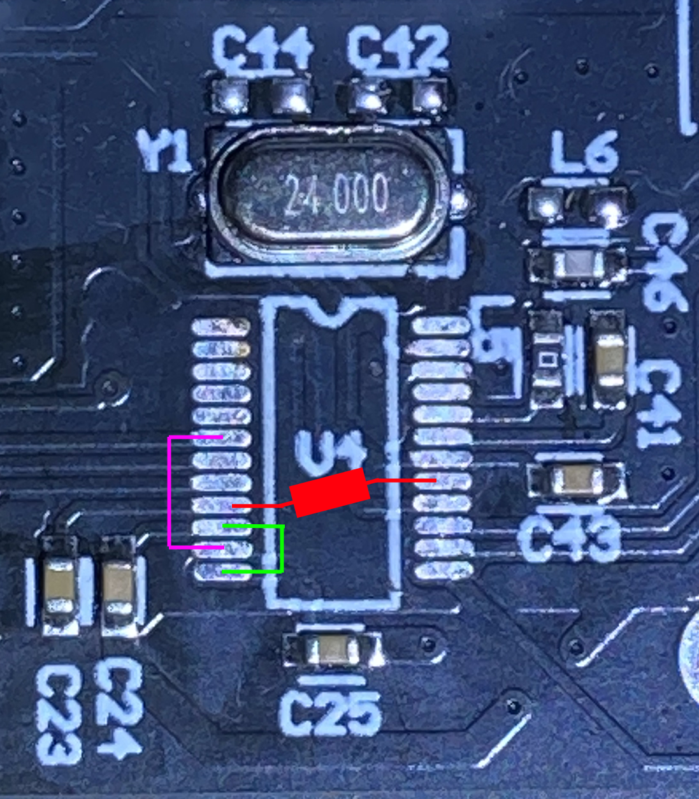
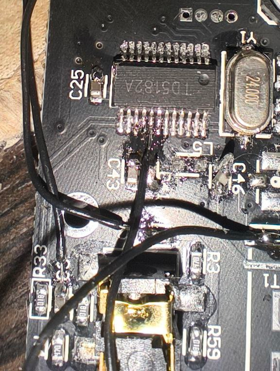
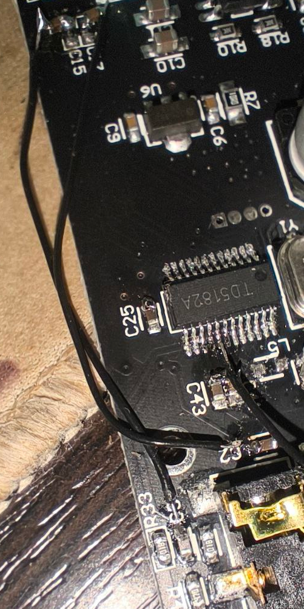

# ZK-MT21-Bluetooth-disable
## Инструкция по отключению блютуз на усилителе ZK-MT21   Instruction manual for disabling Bluetooth on the ZK-MT21 amplifier

# 🛠️ Модификация усилителя ZK-MT21: отключение Bluetooth и фиксация AUX-входа

## ⚠️ Проблема

Усилитель **ZK-MT21** по умолчанию поддерживает Bluetooth-подключение, что было недопустимо в одной из наших разработок — требуется **исключительно проводной AUX-вход**, без возможности стороннего подключения.

После анализа и реверс-инжиниринга мы выяснили, что:
- Управляющий чип — аналогичный **TD5161A**.
- При подключении к Bluetooth усилитель **автоматически отключает AUX**.
- Решение — **физически обойти логику переключения** и заставить устройство работать только в режиме AUX.

---

## ✅ Требуемые действия

Для полного отключения Bluetooth и фиксации работы на AUX необходимо:

1. **Прямое соединение сигнальных цепей AUX и усилителя**  
   → Соединить входной и выходной контакты аналогового тракта (AUX IN ↔ AMP IN), минуя контроллер.

2. **Подача постоянного сигнала Enable**  
   → Подключить пин `ENABLE` контроллера к **0V** — это «заставляет» усилитель оставаться включённым и игнорировать Bluetooth-сигналы.

> 💡 **Результат:** Усилитель больше не переключается на Bluetooth. Работает **только** через физический AUX-кабель.

---
- 🧩 **Схема подключения**
(Фото с другой платы)

## PINOUT

| Pin | ON - OFF / Примечание     | Pin | ON - OFF / Примечание     |
|-----|---------------------------|-----|---------------------------|
| 1   | 0 - 0                     | 24  | osc                       |
| 2   | 3.3  LED                  | 23  | osc                       |
| 3   | LED                       | 22  | gnd - ant                 |
| 4   | 0 - 0                     | 21  | 0 - 0                     |
| 5   | 0 - 0                | 20  | ant                       |
| 6   | sig  auxl                 | 19  | 0 - 0                     |
| 7   | 0 - 0                     | 18  | 0 - 0                     |
| 8   | 0 - 0                     | **17**  | **0 - 3.3  enable**           |
| 9   | GND                       | 16  | 3.3 - 3.3                 |
| 10  | sig  outR                 | 15  | 0 - 0                     |
| 11  | sig  outL                 | 14  | 5.6  vcc                  |
| 12  | sig  auxR                 | 13  | AUX detect                |
## 📸 Решения (🖼️ **Фотографии плат**)

---

### ✅ **Без удаления чипа**  
*— Быстрая доработка, без пайки чипа*
  
- **Действия:**
  1. **Поднять конденсаторы C15 и C17** — отпаять их от платы, чтобы разорвать цепь подтяжки.  
    
  2. **На 17-й пин микросхемы подать 0 В через резистор** — использован резистор **22 Ом** (не виден на фото, но есть).  
    

- **Результат:**  
    
  *Плата работает стабильно, сигнал `enable` корректно сброшен.*

---

### 🧨 **С удалением чипа**  
*— Окончательное решение, требует паяльника и аккуратности*

- **Действие:** Полностью удалить микросхему.  
- **Результат:**  
    

---

## ✅ Итог

Оба варианта **проверены на практике**:

## ⚠️ Важно

- Для **ZK-TB21** есть [другой способ](https://pearlpalms.github.io/ZK-TB21_bluetooth_remove/).

---

## ℹ️ Примечания

> **Исходники фото без обрезки есть в репозитории.**

---

*Собрано с любовью к надёжности.  
https://kb-injenerno.ru 
https://t.me/arm0id 
https://t.me/sumert*

---
