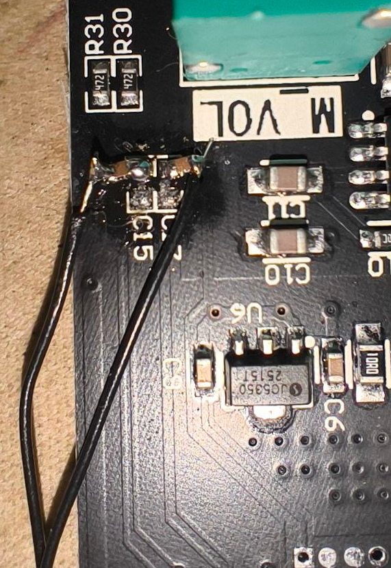

# ZK-MT21-Bluetooth-disable
## Инструкция по отключению блютуз на усилителе ZK-MT21   Instruction manual for disabling Bluetooth on the ZK-MT21 amplifier

[English version](#english_version)

# 🛠️ Модификация усилителя ZK-MT21: отключение Bluetooth и фиксация AUX-входа

## ⚠️ Проблема

Усилитель **ZK-MT21** по умолчанию поддерживает Bluetooth-подключение, что было недопустимо в одной из наших разработок — требуется **исключительно проводной AUX-вход**, без возможности стороннего подключения. *По умолчанию bluetooth имеет более высокий приоритет и некто может **заменить** вашу прекрасную музыку на свой рэп*

После анализа и реверс-инжиниринга мы выяснили, что:
- Управляющий чип — аналогичный **TD5161A**.
- При подключении к Bluetooth усилитель **автоматически отключает AUX**.
- Решение — **физически обойти логику переключения** и заставить устройство работать только в режиме AUX.

---

## ✅ Требуемые действия

Для полного отключения Bluetooth и фиксации работы на AUX необходимо:

1. **Прямое соединение сигнальных цепей AUX и усилителя**  
   → Соединить входной и выходной контакты аналогового тракта (AUX IN ↔ AMP IN), минуя контроллер.

2. **Подача постоянного сигнала Enable**  
   → Подключить пин `ENABLE` усилителей к **GND** — это «заставляет» усилитель оставаться включённым и игнорировать Bluetooth-сигналы.

> 💡 **Результат:** Усилитель больше не переключается на Bluetooth. Работает **только** через физический AUX-кабель.

---- 🧩 **Схема подключения**
(Фото с другой платы)

## PINOUT

| Pin | Примечание     | Pin |  Примечание     |
|-----|---------------------------|-----|---------------------------|
| 1   | ?                     | 24  | osc                       |
| 2   | LED1                  | 23  | osc                       |
| 3   | LED2                       | 22  | ANT (GND)                |
| 4   | ?                     | 21  | GND                     |
| 5   | ?                     | 20  | ANT                       |
| 6   | auxL                 | 19  | GND                    |
| 7   | ?                    | 18  | GND                     |
| 8   | ?                    | **17**  | **amplifier enable**       |
| 9   | GND                       | 16  | 3.3V                 |
| 10  |   outR                 | 15  | ?                     |
| 11  |   outL                 | 14  |  VCC                  |
| 12  |   auxR                 | 13  | AUX detect                |

## 📸 Решения (🖼️ **Фотографии плат**)

---

### ✅ **Без удаления чипа**  
*— Быстрая доработка, без выпаивания чипа*

- **Действия:**
  - **Поднять конденсаторы C15 и C17** — отпаять их от платы, чтобы разорвать цепь подтяжки.  
    
  - **На 17-й пин микросхемы подать GND через резистор** — использован резистор **22 Ом** (не виден на фото, но есть).  
    

- **Результат:**  
    
  *Плата работает стабильно, сигнал `enable` корректно сброшен.*

---

### 🧨 **С удалением чипа**  
*— Окончательное решение, требует паяльника и аккуратности*

- **Действие:** Полностью удалить микросхему.  
- **Результат:**  
    

---
## ✅ Итог

Оба варианта **проверены на практике**

## ⚠️ Важно

- Для **ZK-TB21** есть [другой способ](https://pearlpalms.github.io/ZK-TB21_bluetooth_remove/).

---

## ℹ️ Примечания

> **Исходники фото без обрезки есть в репозитории.**

---

*Собрано с любовью к надёжности by Injenerno.* 
[Наш сайт](https://kb-injenerno.ru) 
 **Контакты**:  Роберт [Tg](https://t.me/arm0id) Влад [Tg](https://t.me/sumert) 

---

English version

# English_version  
## Guide to disabling Bluetooth on the ZK-MT21 amplifier Instruction manual for disabling Bluetooth on the ZK-MT21 amplifier  

# 🛠️ ZK-MT21 Amplifier Modification: Bluetooth Disabling and AUX Input Lock  

## ⚠️ Problem  

The **ZK-MT21** amplifier supports Bluetooth connectivity by default, which was unacceptable in one of our projects—we require **wired AUX input only**, with no possibility of external connection. *By default, Bluetooth takes priority, and someone could **replace** your beautiful music with their rap.*  

After analysis and reverse engineering, we found that:  
- The control chip is similar to **TD5161A**.  
- When Bluetooth connects, the amplifier **automatically disables AUX**.  
- The solution is to **physically bypass the switching logic** and force the device to operate exclusively in AUX mode.  

---  

## ✅ Required Steps  

To fully disable Bluetooth and lock operation to AUX:  

1. **Direct connection of AUX and amplifier signal paths**  
   → Connect analog signal chain inputs directly to amplifier inputs (AUX IN ↔ AMP IN), bypassing the controller.  

2. **Apply a permanent Enable signal**  
   → Connect the amplifier’s `ENABLE` pin to **GND**—this “forces” the amplifier to remain active and ignore Bluetooth signals.  

> 💡 **Result:** The amplifier no longer switches to Bluetooth. It works **only** via the physical AUX cable.  

---- 🧩 **Wiring Diagram**  
(Photo from another board)  

  

## PINOUT  

| Pin | Note               | Pin | Note                     |  
|-----|--------------------|-----|--------------------------|  
| 1   | ?                  | 24  | osc                      |  
| 2   | LED1               | 23  | osc                      |  
| 3   | LED2               | 22  | ANT (GND)                |  
| 4   | ?                  | 21  | GND                      |  
| 5   | ?                  | 20  | ANT                      |  
| 6   | auxL               | 19  | GND                      |  
| 7   | ?                  | 18  | GND                      |  
| 8   | ?                  | **17** | **amplifier enable**    |  
| 9   | GND                | 16  | 3.3V                     |  
| 10  | outR               | 15  | ?                        |  
| 11  | outL               | 14  | VCC                      |  
| 12  | auxR               | 13  | AUX detect               |  

## 📸 Solutions (🖼️ **Board Photos**)  

---  

### ✅ **Without Removing the Chip**  
*— Quick modification without desoldering the chip*  

- **Steps:**  
  - **Lift capacitors C15 and C17**—desolder them from the board to break the pull-up circuit.  
      
  - **Connect pin 17 of the IC to GND via a resistor**—a **22 Ω resistor** was used (not visible in the photo, but present).  
      

- **Result:**  
    
  *Board operates stably; the `enable` signal is correctly pulled low.*  

---  

### 🧨 **With Chip Removal**  
*— Final solution; requires a soldering iron and precision*  

- **Action:** Completely remove the IC.  
- **Result:**  
    

---  
## ✅ Conclusion  

Both approaches have been **tested in practice**.  

## ⚠️ Important  

- For the **ZK-TB21**, a [different method](https://pearlpalms.github.io/ZK-TB21_bluetooth_remove/) exists.  

---  

## ℹ️ Notes  

> **Full-resolution, unedited source photos are available in the repository.**  

---  

*Assembled with love for reliability by Injenerno.*   
[Our website](https://kb-injenerno.ru)   
**Contacts:**   
Robert [Tg](https://t.me/arm0id)   
Vlad [Tg](https://t.me/sumert)

